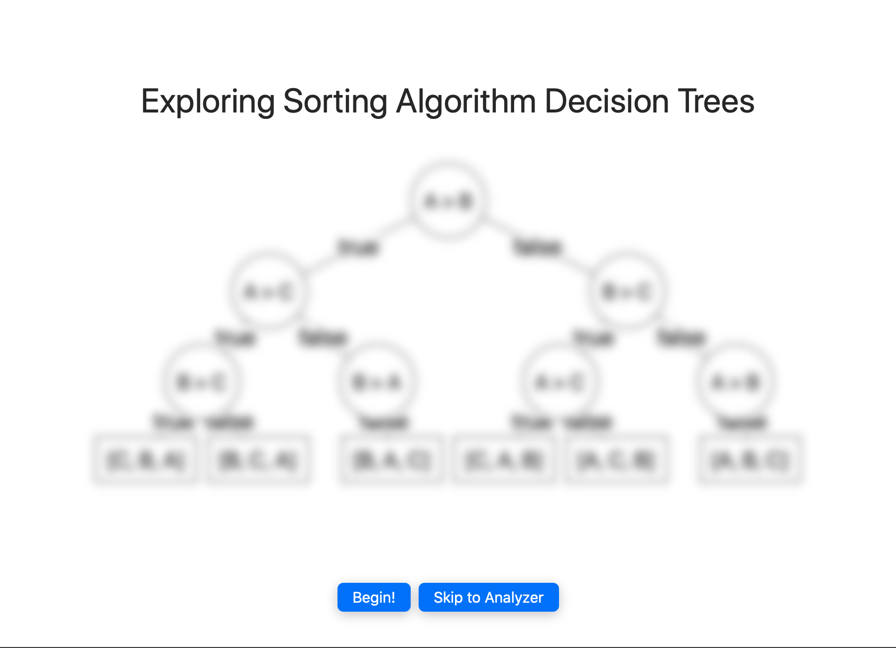
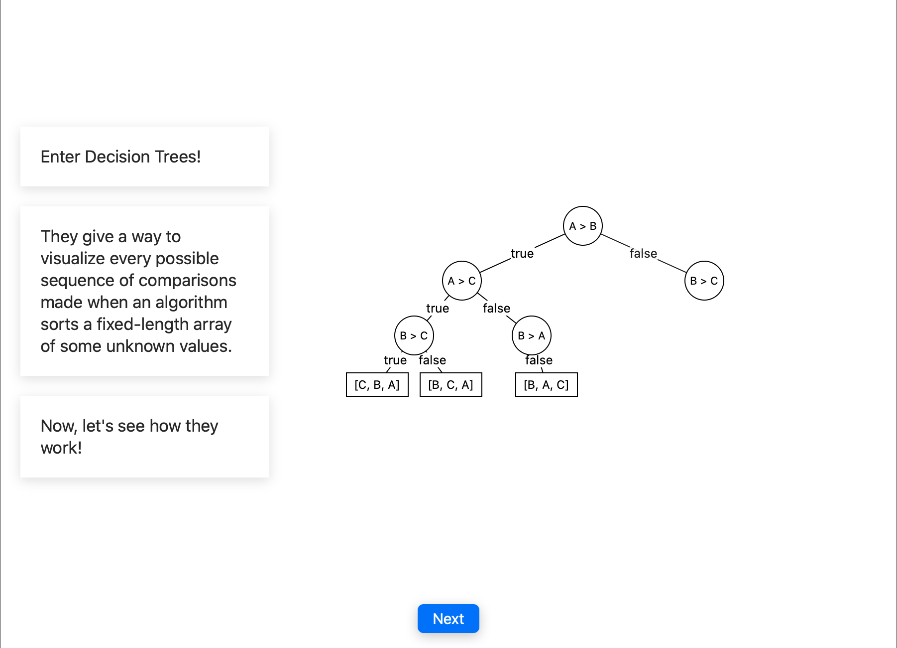
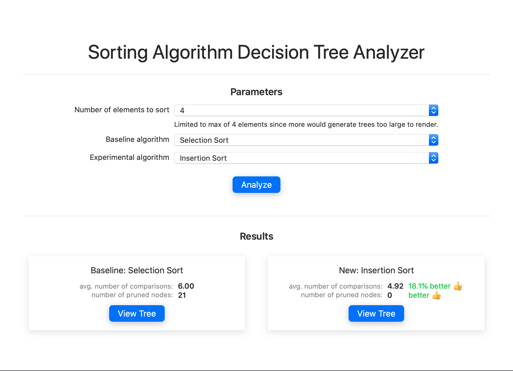
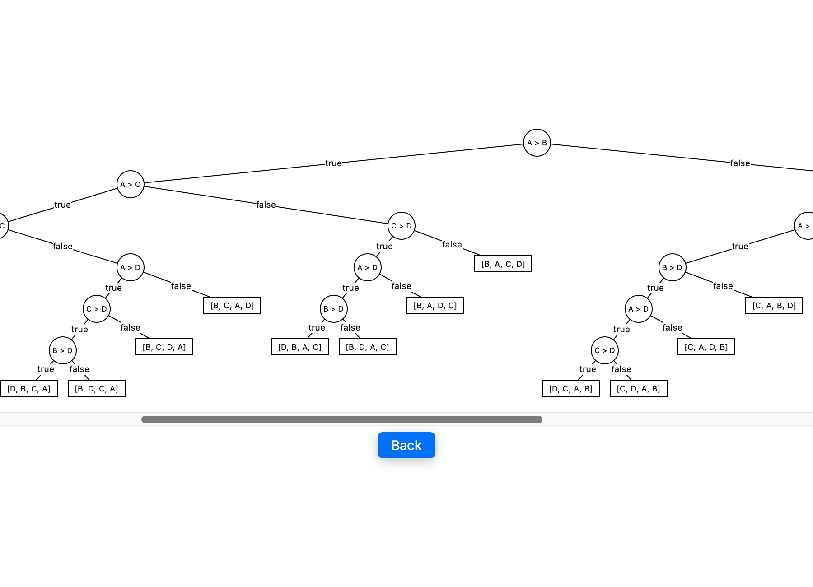

# Swift Student Challenge 2020 - Exploring Sorting Algorithm Decision Trees

This is my playground submission to the 2020 WWDC Swift Student Challenge held
by Apple (accepted).

## How it works

This playground first takes the user (a presumed CS student just learning the
basics) on an animated lesson, explaining how decision trees are used to
visualize how sorting algorithms work and to see which are more efficient.

The playground then lets the user interact with a sorting algorithm analyzer,
which compares the decision trees of two sorting algorithms. The analyzer uses a
custom decision tree generator algorithm (developed by me) to generate the trees
for each sorting algorithm. The user can then compare the statistics of each
decision tree and view what the tree looks like.

If the user is ambitious, they can add their own algorithm to the playground and
see how it compares with the others.
